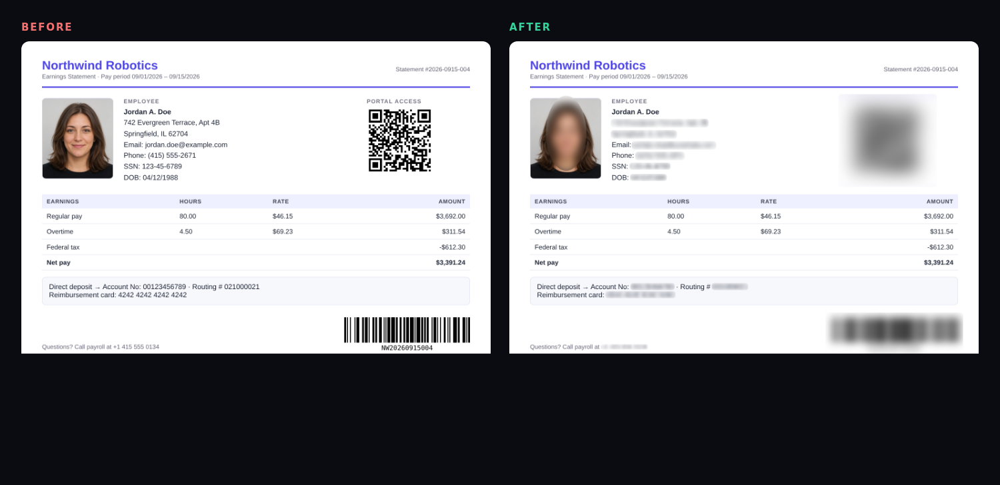
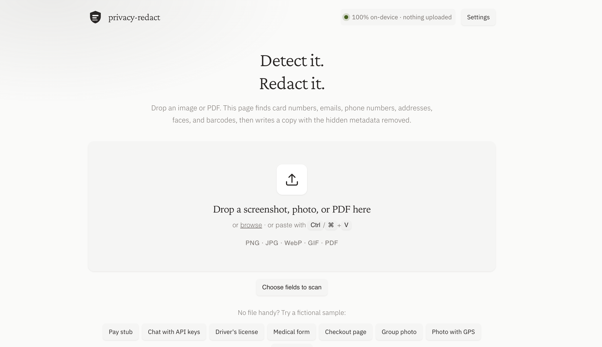
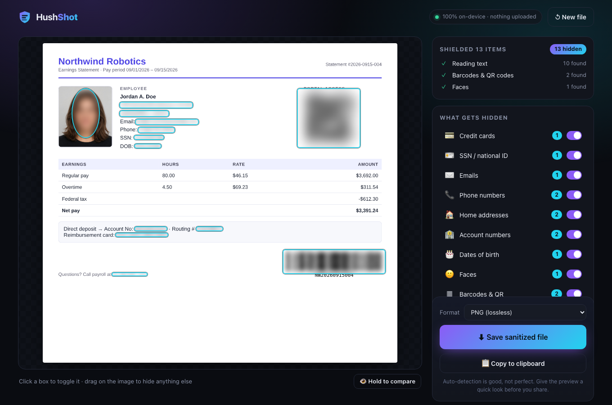
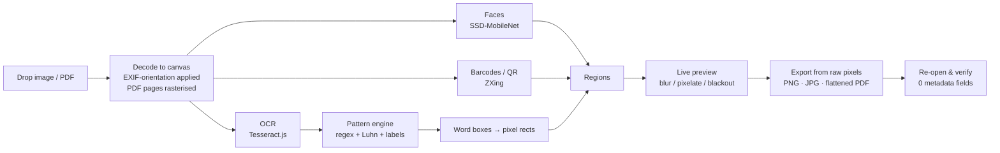

<div align="center">


# privacy-redact

### One-click privacy shield for screenshots & documents

**Drop an image or PDF → sensitive info is auto-blurred → click Save.**

Cards, emails, phones, addresses, faces, barcodes — gone. Hidden metadata — gone. Nothing ever leaves your device.




</div>

---

## Why

We paste screenshots into **ChatGPT, Claude, Slack, Discord, GitHub issues and social media** all day. Every one of them can quietly contain a home address, a card number, a face that isn't yours, or a QR code that logs someone in. And the "fix" — drawing black boxes by hand in Paint or Photoshop — is tedious, easy to get wrong, and usually leaves the **EXIF/GPS/camera-serial metadata** untouched.

privacy-redact makes the safe thing the *easy* thing:

1. **Drop** any image or PDF (or paste a screenshot with <kbd>Ctrl</kbd>/<kbd>⌘</kbd>+<kbd>V</kbd>).
2. **Auto-blur** — sensitive items are found and hidden for you. Click any box to un-hide it, drag to hide something we missed.
3. **Save** (or **Copy to clipboard**) — a clean file with zero metadata, verified before you share it.

> This repository is the library: detection, redaction, and document handling, plus browser components for OCR, faces, barcodes, and PDFs. The page in this repo is a harness for those components, not a brand. A small host that shows each call is in [examples/](examples/README.md).

## Screenshots

| Landing | Workspace |
| --- | --- |
|  |  |

## Before & after gallery

Three redaction styles, seven document types — all produced by the real app. **[See the full gallery →](docs/EXAMPLES.md)**

| Document | Blur · Pixelate · Blackout |
| --- | --- |
| 🧾 Pay stub (photo, QR, barcode) | <a href="docs/EXAMPLES.md#1--pay-stub--image-with-photo-qr-code-and-barcode"></a> |
| 💬 Dark-mode Slack chat (keys, password) | <a href="docs/EXAMPLES.md#2--dark-mode-slack-chat--screenshot-with-secrets"></a> |
| 🪪 Driver's license | <a href="docs/EXAMPLES.md#3--drivers-license--id-card-with-photo-and-barcode"></a> |
| 🏥 Medical intake form | <a href="docs/EXAMPLES.md#4--medical-intake-form--labelled-fields-wrapped-lines"></a> |
| 💳 Checkout page | <a href="docs/EXAMPLES.md#5--checkout-page--card-billing-details-qr"></a> |
| 👨‍👩‍👧 Group photo (faces) | <a href="docs/EXAMPLES.md#6--group-photo--faces-only"></a> |
| 📄 Lease PDF | <a href="docs/EXAMPLES.md#7--lease-pdf-page-2--pdf-with-a-real-text-layer"></a> |

## Features

### 🔍 Detects

| Category | Examples | How |
| --- | --- | --- |
| 💳 **Credit cards** | `4242 4242 4242 4242`, Amex `3782 822463 10005`, masked `**** 4242` | Regex + **Luhn checksum** (tolerates OCR slips on well-formed 4-4-4-4 groups) |
| 🪪 **SSN / national ID** | `123-45-6789`, `SSN: 123456789`, `TIN`, `EIN` | Pattern + invalid-range filtering (`000`, `666`, `9xx`) |
| ✉️ **Emails** | `jane.doe+work@example.co.uk` | RFC-ish regex |
| 📞 **Phone numbers** | `(415) 555-2671`, `+1 415 555 2671`, `+44 20 7946 0958` | US + international patterns |
| 🏠 **Home addresses** | `742 Evergreen Terrace, Apt 4B`, `Springfield, IL 62704`, `PO Box 12`, Canadian & UK postcodes | Street/suffix, City-State-ZIP, PO box rules |
| 🏦 **Account numbers** | `Account No: 00123456789`, `Routing # 021000021`, `MRN`, `Policy`, IBANs | Label-aware: redacts the *value*, not the label |
| 🎂 **Dates of birth** | `DOB: 04/12/1988`, `Date of Birth March 3, 1990` | Only when labelled – ordinary dates are left alone |
| 🔑 **API keys & tokens** | `sk-…`, `AKIA…`, `ghp_…`, `xoxb-…`, JWTs, `password: …` | Vendor prefixes + `key=value` |
| 🙂 **Faces** | Photos, ID pictures, group shots | SSD-MobileNet via TensorFlow.js (tiled scan for small faces) |
| ▦ **Barcodes & QR** | QR, Code 128/39, EAN/UPC, PDF417, Data Matrix, Aztec | Native `BarcodeDetector` if present, else ZXing with multi-scale retry |

### 🧼 Strips hidden data

Before you save, privacy-redact shows exactly what's hiding in your file — and what's about to disappear:

- 📍 GPS coordinates & altitude
- 📷 Camera / phone model, 🔢 body & lens **serial numbers**
- 🕒 Original capture & edit dates
- 👤 Owner / author / copyright, 🛠️ editing software
- 📄 PDF title, author, producer, keywords, dates
- XMP / IPTC blocks, embedded thumbnails, ICC profiles

After export it **re-opens the file it just wrote** and checks that no metadata is left ("re-checked: 0 metadata fields in the output").

### 🎨 Aesthetic, adjustable redaction

- **Blur** (default) – soft, pretty, and irreversible (see [How redaction stays irreversible](#-how-redaction-stays-irreversible))
- **Pixelate** – classic mosaic
- **Blackout** – maximum-paranoia solid fill
- **Strength slider**, per-category switches, click-to-toggle on any box, drag-to-add manual boxes
- **Hold to compare** with the original · multi-page PDFs with page navigation

### 🔒 Private by design

- **Everything runs in your browser tab** — OCR (Tesseract), face detection (TensorFlow.js), barcode decoding (ZXing), PDF rendering (PDF.js).
- Models, WASM and fonts are **bundled** – no CDN calls at runtime. Works fully offline after first load.
- Production builds ship a strict **Content-Security-Policy** (`connect-src 'self'`, `form-action 'none'`, `object-src 'none'`) so the page is *technically unable* to send your file anywhere.
- The end-to-end test fails if the app makes even one request to another origin.
- No analytics, no cookies, no accounts, no telemetry.

## Quick start

### Run it locally

```bash
npm install          # also copies the OCR / face / PDF assets into public/vendor
npm run dev          # → http://localhost:5173
```

Production build (static files, host anywhere — S3, Netlify, `python -m http.server`, a USB stick):

```bash
npm run build        # → dist/
npm run preview      # serve dist/ at http://localhost:4173
```

Requires Node 18+ and a modern browser (Chrome/Edge 119+, Firefox 121+, Safari 17.4+).

### Desktop app (experimental)

A tiny Electron shell is included. It serves the built app from a loopback-only server and **blocks every non-local network request**.

```bash
npm run desktop        # build + launch
npm run desktop:pack   # installers via electron-builder (dmg / nsis / AppImage) → release/
```

> The desktop wrapper hasn't had the same test coverage as the web app yet — PRs and bug reports welcome.

## How it works



1. **Decode.** Images become a canvas (transparency flattened, EXIF orientation baked in). PDFs are rendered page-by-page at 144 dpi.
2. **Detect.** OCR yields words with bounding boxes. Screenshots are upscaled and dark themes inverted first to help the OCR. Each line is scanned with the rule set in [`src/detect/patterns.js`](src/detect/patterns.js); matches are mapped back to pixels — even partial words like `Email:jane@x.com` are trimmed to just the address.
3. **Review.** Every detection is a box you can toggle. Categories can be switched off wholesale.
4. **Export.** The redacted canvas is re-encoded from scratch and re-checked.

## 💥 How redaction stays irreversible

Bad redaction is worse than none, so:

- **Blur and pixelate average pixels into blocks first** (only ~1–2.4 cells across a line of text, ~5–11 across a face), add random per-block noise, and only *then* smooth. The original detail is discarded, not merely obscured — there is nothing to "un-blur". Text cells are deliberately coarser than a glyph because fine mosaics of a known font can be brute-forced back into text ([Depix](https://github.com/spipm/Depix)-style attacks); the jitter stops exact colour matching.
- **Nothing is layered.** The output image is a new set of pixels. There is no hidden original underneath a box, unlike PDF "highlight" annotations that can be deleted.
- **PDFs are flattened.** Each page is rasterised, redacted and re-embedded as an image, so the text layer beneath a redaction no longer exists. (The trade-off: exported PDFs aren't text-selectable.)
- **Nothing is copied byte-for-byte from your source file**, so EXIF, XMP, IPTC, thumbnails and PDF info dictionaries can't tag along. PDFs are written with metadata auto-stamping disabled (no `Producer`, no dates).
- The e2e suite **OCRs the exported file** and asserts that the SSN, email, phone, card, address and account numbers of the sample document are no longer readable.

> Want zero doubt for something extremely sensitive? Pick **Blackout** and drag the strength up.

## Limitations — please read

privacy-redact is a safety net, not a guarantee. **Always glance at the preview before sharing.**

- **Names aren't detected.** Names are context-dependent and would cause a lot of false positives with regex-only detection. Use the drag-to-hide tool (a local NER model is on the [roadmap](#roadmap)).
- **OCR isn't perfect.** Tiny fonts, low contrast, unusual fonts, handwriting, rotated or curved text can be missed. A digit misread by OCR can still leave a card *pattern* undetected if it's badly broken up.
- **English-first.** Address rules are US/Canada/UK oriented; phone rules include international formats; OCR uses the English model.
- **Faces:** heavily rotated, occluded or tiny faces can be missed; non-faces occasionally trigger. Wide images are scanned in overlapping tiles so small faces are found, at the cost of speed. Toggle boxes to correct.
- **Barcodes:** without the native `BarcodeDetector` API (Chrome on Windows/Linux, Firefox), 1D codes are located via scan-line heuristics and a structure check that rejects text mistaken for bars. Damaged or very small codes can be missed.
- **Not detected by design:** license plates, signatures, logos, company names, free-form medical text.
- **HEIC** photos aren't decodable by browsers – convert to JPG/PNG first.
- **PDFs** are limited to 60 pages and become image-only.
- **Performance:** first scan loads ~15 MB of models. Face detection uses WebGL when available; on machines without GPU acceleration it falls back to CPU and can take a while on big images.
- Filenames aren't scrubbed beyond adding `-redacted`. If your filename contains your name, rename it.

## Project structure

```
privacy-redact/
├── index.html                # app shell
├── src/
│   ├── main.js               # UI controller (state, scanning pipeline, export)
│   ├── style.css
│   ├── detect/
│   │   ├── patterns.js       # 🧠 the rule engine (pure JS, unit-tested)
│   │   ├── textRegions.js    # OCR words ↔ character ranges ↔ pixel rects, wrapped-line + neighbour merging (pure, unit-tested)
│   │   ├── ocr.js            # Tesseract.js worker wrapper (+ pre-processing)
│   │   ├── faces.js          # TensorFlow.js face detection with tiling + NMS
│   │   └── barcodes.js       # BarcodeDetector / ZXing multi-scale fallback
│   ├── render/effects.js     # blur · pixelate · blackout
│   └── io/
│       ├── loader.js         # image + PDF → canvases
│       ├── metadata.js       # what's hidden in the file + post-export verification
│       └── exporter.js       # PNG / JPG / flattened PDF writers
├── scripts/
│   ├── copy-assets.mjs       # vendors OCR/face/PDF assets into public/vendor (postinstall)
│   ├── make-samples.mjs      # generates the fictional sample docs
│   └── make-before-after.mjs # README hero image
├── public/samples/           # fictional pay stub, chat, ID, medical form, checkout, group photo, GPS JPG, lease PDF
├── docs/EXAMPLES.md          # before/after gallery (docs/examples/*)
├── test/                    # node --test unit tests (*.test.js)
│   └── smoke.e2e.test.js     # Playwright end-to-end test incl. OCR-of-output check (npm run test:e2e)
├── desktop/                  # optional Electron wrapper
└── .github/workflows/        # CI + GitHub Pages deploy
```

## Testing

```bash
npm test                                   # unit tests (rules, box mapping, metadata, redaction cell size) — under a second
npm run test:e2e:setup                     # one-time: download Chromium for Playwright
npm run build && npm run preview &         # then:
npm run test:e2e -- http://localhost:4173/ # full pipeline in headless Chromium
npm run test:e2e:ci                        # all of the above in one go: install Chromium, build, serve, test (used by the manual E2E workflow)
```

The e2e test drives the real UI against the **production build** (so the CSP is enforced) and asserts:

- every category is detected on the sample pay stub (email, phones, SSN, addresses, card, account/routing, DOB, face, QR + barcode)
- the exported PNG can no longer be OCR'd for any secret, while normal text remains readable
- a JPEG with **GPS + camera model** comes out with no EXIF segment
- a 2-page PDF with a real text layer and author metadata comes out with **no selectable secret text and an empty info dictionary**
- **zero** requests to external origins and zero console errors / CSP violations

All sample data is fictional (`4242 4242 4242 4242` is a public test card number; the portrait is AI-generated). Regenerate with `npm run samples`.

## Roadmap

- [ ] Optional local **name / organisation detection** (small on-device NER model)
- [ ] Batch mode – drop a folder, get a folder
- [ ] Watch-folder / clipboard-monitor mode for the desktop app
- [ ] More locales (EU addresses & national IDs, IBAN validation, non-Latin OCR packs)
- [ ] License-plate & signature detectors
- [ ] "Keep text selectable" PDF mode using true content-stream redaction
- [ ] Browser extension: right-click any image → privacy-redact
- [ ] Installable PWA (a web manifest ships already; offline service worker still to do)
- [ ] Custom rules (bring your own regex / keywords, e.g. an employee-ID format)

## FAQ

**Does anything get uploaded?** No. There is no backend. Open your browser's Network tab and see for yourself — after the page loads, dropping a file causes zero requests.

**Why not just blur it in Preview / Paint?** You can, but you have to spot every item yourself, get the boxes right, and remember that the file's EXIF/GPS data is still there. privacy-redact does the spotting and the scrubbing.

**Is PNG/JPG export lossless / does it change my image?** PNG is lossless. JPG is re-encoded at quality 93. Colour profiles are dropped (part of metadata stripping), which may shift colours very slightly on wide-gamut photos.

**Can I add my own patterns?** Yes — see [CONTRIBUTING.md](CONTRIBUTING.md#adding-a-detection-rule). It's one object in `patterns.js`.

**Why is the first scan slow?** The OCR engine and face model load on first use, then get reused for the rest of the session.

## Security

Found a way to recover redacted content or leak data? Please see [SECURITY.md](SECURITY.md) — use a private report, and only ever share fictional documents.

## Credits

This repository started from [Hushshot](https://github.com/SYasJ/hushshot) by [SYasJ](https://github.com/SYasJ). That project is the offline browser tool that finds private content in a screenshot or PDF, redacts it, and strips metadata. Its license is MIT. This repository borrowed that first approach and aligned it as a library a host can call, including before a document goes to an AI.

This repository runs them through the JavaScript projects listed with each one. Those projects keep their own licenses.

| Project | What it does here | License |
| --- | --- | --- |
| [Tesseract OCR](https://github.com/tesseract-ocr/tesseract) | Recognizes text. The English traineddata vendored with the page is Tesseract language data. | Apache-2.0 |
| [Tesseract.js](https://github.com/naptha/tesseract.js) and [tesseract.js-core](https://github.com/naptha/tesseract.js-core) | Runs that engine in the browser and in Node, from the vendored worker and WASM. | Apache-2.0 |
| [TensorFlow](https://github.com/tensorflow/tensorflow) and [TensorFlow.js](https://github.com/tensorflow/tfjs) | Runs the face model. TensorFlow.js is bundled inside face-api and is not loaded from the network. | Apache-2.0 |
| [face-api.js](https://github.com/justadudewhohacks/face-api.js), continued as [@vladmandic/face-api](https://github.com/vladmandic/face-api) | Finds faces with the SSD MobileNet v1 model shipped in that package. | MIT |
| [ZXing](https://github.com/zxing/zxing) and [@zxing/library](https://github.com/zxing-js/library) | Decodes barcodes and QR codes when the browser has no `BarcodeDetector`. | Apache-2.0, MIT for the JavaScript port |
| [PDF.js](https://github.com/mozilla/pdf.js) | Reads and rasterizes PDFs. | Apache-2.0 |
| [pdf-lib](https://github.com/Hopding/pdf-lib) | Writes the flattened PDF. | MIT |
| [exifr](https://github.com/MikeKovarik/exifr) | Reads image metadata so the export can be checked. | MIT |

The page is built with [Vite](https://vitejs.dev/) (MIT). End-to-end tests use [Playwright](https://playwright.dev/) (Apache-2.0). [Crimson Pro](https://github.com/Fonthausen/CrimsonPro) and [IBM Plex Sans](https://github.com/IBM/plex) are used under the SIL Open Font License.

## License

All rights reserved. See [LICENSE](LICENSE). See [CONTRIBUTING.md](CONTRIBUTING.md) to get involved.

