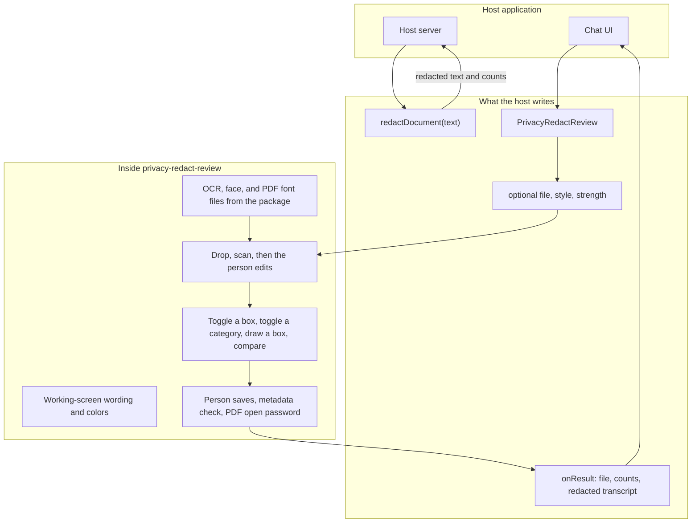
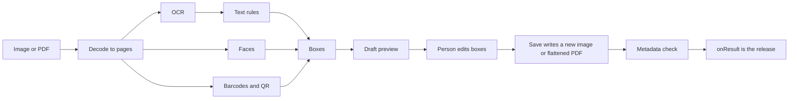
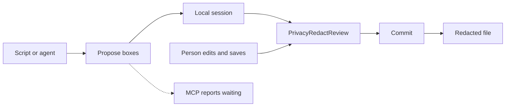
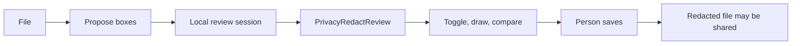

# Design

privacy-redact is a published library. A host installs it by name and uses two entries. The server entry redacts plain text. The review element redacts an image or a PDF and carries the working screen: drop, scan, boxes, style, metadata, transcript, and save. A command-line tool and an MCP wrapper come later. Both call the same engine. There is no account, database, or application server in the core.

The page at the repository root is a harness. It mounts the same review element and keeps the marketing around it: the name, the headline, the samples, and the FAQ. A product built on the library has its own server and its own UI, and installs the package the same way any other host does.

Product requirements are in [REQUIREMENTS.md](REQUIREMENTS.md). This note is the shape of the system. The only code here is the usage a consumer writes.

## What a consumer installs

```bash
npm install privacy-redact
```

The package name is `privacy-redact`. A consumer imports that name. The dependency is a released version, with no path back into this repository.

| Entry | Import | Use |
| --- | --- | --- |
| Server | `privacy-redact` | Redact plain text before it is stored or sent onward |
| React | `privacy-redact/react` | Mount the review screen |
| Element | `privacy-redact/ui` | The same screen as the tag `privacy-redact-review`, for a host that is not React |

`PrivacyRedactReview` is a thin React mount of `privacy-redact-review`. The screen has one implementation.

## One release

The engine and the review screen are two entries of one package, released together. They are not a frontend library and a backend library. A screen from one version and boxes from another will not match.

A host uses one of these:

| Host | What they use |
| --- | --- |
| Browser only | `privacy-redact/ui` or `privacy-redact/react`. Decode, scan, review, and save run in the page. |
| Local detection, no screen | `privacy-redact` for plain text. The command, later, for an image or a PDF. |
| Their detector, this screen | The review element, opened on a session the host already has. |

The session is defined under Human review: page images and boxes. The command writes one. A host may write one from a detector they run themselves. The element opens it and does not scan again. The person edits, then save paints the file.

The original stays with the host. This package does not upload a document, call an outside detector, or take a model URL.

A file that is already painted cannot be reviewed here. The person cannot turn a bar off once it is in the pixels. Review is the edit that happens before paint.

Later, a second package is only for install size, so a text-only caller does not download the OCR, face, and PDF files. It carries the same version as this package.

## Surface

The host touches the edges. The review flow stays inside the element, including its current wording, colors, and manual edits. The scan is a draft. A person confirms it before the file or the text goes to an AI or to another person. The harness marketing stays outside.



A consumer should know these boundaries:

- Pasted chat text goes to `redactDocument` on the server. The composer shows that redacted string for the person to read and edit. Their send is what releases it.
- Images and PDFs go to `PrivacyRedactReview`. After the scan, the person can turn a box off, turn a whole category off, draw a box around something the scan missed, and hold to compare with the original. The host cannot hide those controls.
- The host may pass a file, a style, and a strength. Category switches stay on the review screen.
- `onResult` fires when the person saves, and only then. The element still writes the download. The host may attach that output. It does not send the original file, the scan, or the transcript when the scan finishes.
- The result carries the redacted file, counts per category, whether metadata verified clean, whether a PDF stopped at 60 pages, and the redacted transcript. The original transcript stays on the review screen.
- The element loads its engine from the app that mounted it. Model files ship inside the package, on that machine, and the page requests them from its own origin. A consumer does not set a model URL and does not send the document to another host.
- Detection is English-first. Names are not detected. The saved file can still contain something the scan missed.

## Library usage

Server, for a pasted passage:

```js
import { redactDocument } from 'privacy-redact';

const { text, findings } = redactDocument(passage);
```

`text` is the redacted string. `findings` is a count per detector. Omit the detector list so a newer detector is included on the next run. The matched secrets are not in the return value. The host shows `text` in the composer for the person to read and change. The message leaves only when that person sends it.

React, for an image or PDF beside the chat:

```jsx
import { PrivacyRedactReview } from 'privacy-redact/react';

function Attachment({ pendingFile, onAttach }) {
  return (
    <PrivacyRedactReview
      file={pendingFile}
      style="blur"
      strength={0.65}
      onResult={onAttach}
    />
  );
}
```

`file` is optional. When it is omitted, the person drops a file inside the element. `style` is `blur`, `pixelate`, or `blackout`. When `style` and `strength` are omitted, the element uses blur at `0.65`, which is the screen's own default. `strength` runs from 0 to 1.

```js
function onAttach(result) {
  const { file, filename, findings, clean, truncated, transcript } = result;
  approved = { file, filename, transcript, findings, clean, truncated };
}
```

`onAttach` runs because the person saved. The chat holds `approved` until that same person sends the message. The pending file is not uploaded when it is dropped, and it is not uploaded when the scan finishes.

`filename` follows the screen's rule: the original name plus `-redacted`. `transcript` is the redacted reading, the one that matches the boxes still turned on. `clean` reports the metadata check. `truncated` is true when a PDF was longer than 60 pages.

A host that is not React registers the element and uses the tag:

```html
<script type="module">
  import 'privacy-redact/ui';
</script>
<privacy-redact-review></privacy-redact-review>
```

## Review element

The element owns one document at a time: the open pages, the current page, and which boxes are on. Decoding, the three scan passes, drawing, and export sit behind that screen.

The working flow is the current one. The person drops a file or the host passes one in. The element decodes it, scans it, and shows the preview. The scan will miss some private content, so the preview is a draft for the person to finish.

The person can turn any box off, turn a whole category off, and drag a new box over anything still visible. They can hold to compare with the original, change style and strength, and open the transcript. The transcript stays redacted unless they switch it. Save writes the boxes that are still on. Those controls, and the words on them, belong to the element. A host does not hide them, replace them, or restyle the flow.

Save is the confirmation. Until that click, the document stays in the element. A host sends it to an AI or to another person only from `onResult`.

The harness mounts this element in the workspace and keeps its own landing page around it. A host that adds chat can open it when a file is attached, and from a link that never talks to an AI. It does not rebuild the review screen.

An encrypted PDF asks for its open password inside the element, before the first page is drawn. A wrong password asks again. Cancel leaves the file unopened. On save, an optional open password encrypts the flattened PDF after the redactions are painted. An empty password leaves the export unlocked. The password is used for that open or that save, then dropped. It is not a prop, and it is not part of `onResult`.

A scan pass that fails is skipped. The person can still draw a box. That is the screen's rule. The later command is stricter.

## Pipeline

Decoding turns an image into one page and a PDF into a page per sheet, up to 60 pages. Orientation is applied and transparency is flattened onto white. PDF JavaScript is not run.

Each page is scanned in three passes: text, codes, then faces. Text is read with an English OCR model, then matched against the shared text rules. Faces use a small local model, with extra tiles on large photos. Codes use the browser's detector when it exists, and a JavaScript decoder otherwise.

The preview paints redactions on a copy of the page. The original pixels stay untouched until export. Blur and pixelate average pixels into coarse blocks before any smoothing. Blackout replaces the area with a solid fill. Export writes a new file from those pixels, so hidden metadata and any PDF text layer are left behind. The new file is opened again to confirm the metadata is empty. When the export has an open password, that check uses the same password.



Text rules, box placement, and the metadata summary are plain logic with no browser, so they can be tested on their own. The element and the later command both call that logic. A host does not keep its own pattern list.

## Stack

The element is plain JavaScript. The React package only mounts it. The harness page is built with Vite. There is no UI framework in the core.

| Job | Library |
| --- | --- |
| OCR | Tesseract.js, English model |
| Faces | face-api, with TensorFlow.js bundled in |
| Barcodes | Browser detector, then ZXing |
| Read PDFs | PDF.js |
| Write PDFs | pdf-lib |
| Read metadata | exifr |

Node hosts the text entry, the tests, and later the command. End-to-end tests run the production harness in headless Chromium. An optional Electron shell can show that build. It is not part of the element, and its packaging tools are not pinned in the lockfile.

## Privacy boundary

Model files, the OCR engine, and PDF fonts are part of the package. The host app serves them on its own origin, which is the origin of the page that mounted the element. After that load, a scan does not call another host.

The harness production build adds a content security policy that allows connections only back to the page itself. Dev mode does not, because the build tool needs its own scripts. Dev and preview listen on localhost. A real document goes through a production build, the installed element on the host's origin, or the later local command.

The original page and the full reading stay in the tab until the person starts a new file or closes the tab. They are not written to disk. `onResult` carries the redacted reading only, and only after the person saves. The command and MCP stay shorter until that confirmation: they report that the document is waiting for review, and they do not include the reading.

The desktop shell, when used, serves the built page on the local machine only and blocks requests anywhere else.

## Command-line tool

The element stays the human screen. The command can run the scan without asking questions mid-run. It cannot release the document. A person still opens `PrivacyRedactReview`, edits the boxes, and saves before the file goes to an AI or to another person.



The command takes a local path, or bytes the caller already holds. It runs in Node, on a Node canvas, and does not start Chromium. Face detection uses the CPU path. Barcodes use the JavaScript decoder. Models are the copies shipped in the package. The command does not download the OCR engine, and it is not the Vite dev server.

Propose uses blackout and every category on, unless the caller sets a style, a strength, or an explicit category. Turning a category off is named in the result. If OCR, face detection, or barcode detection fails to load, the command fails and writes no session a caller could treat as finished. A PDF longer than 60 pages is reported as truncated. An encrypted PDF fails, because the command does not prompt and does not invent a password.

Propose writes a local session and reports that the document is waiting for a person. The report is counts per category, whether the PDF was truncated, and which detector failed. It does not include a shareable file, the transcript, matched secrets, metadata values, crops, or the original bytes. Logs stay free of file contents and detector text.

Commit runs after the person saves in the review element. It paints the edited boxes, writes the file under a neutral name, checks metadata, and removes the session. Its report adds whether metadata verified clean.

MCP is a later wrapper around this command. It speaks to the agent over stdio and does not listen on a network port. Before the person saves, it returns the waiting report. It is not a second redaction engine, and it does not send the document to a model to be checked.

## Human review

A person is in the loop for every document. The command proposes the boxes. `PrivacyRedactReview` is where the person corrects them and confirms. There is no release that skips that screen.



The session holds the page images and the boxes: where they are, what category they are, and whether they are on. It does not hold the transcript or the metadata values. The command writes that session. A host may write the same session from a detector they run themselves. The element opens it with the same controls as a fresh scan: turn a box off, turn a category off, draw a box, hold to compare. It does not scan the file a second time.

Commit paints those edited boxes, checks metadata, and removes the session. The page images stay in the session the person is looking at. The message back to the model after save is the short commit report.
