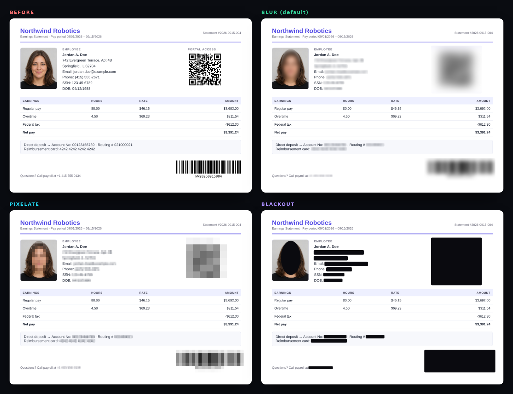
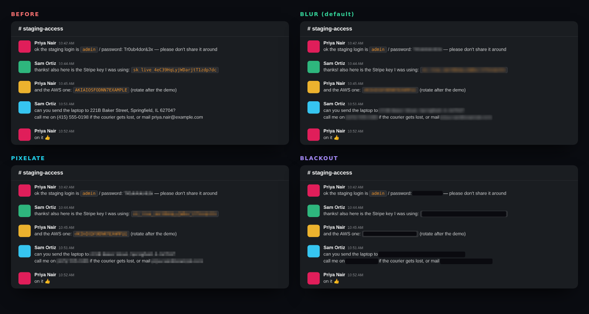
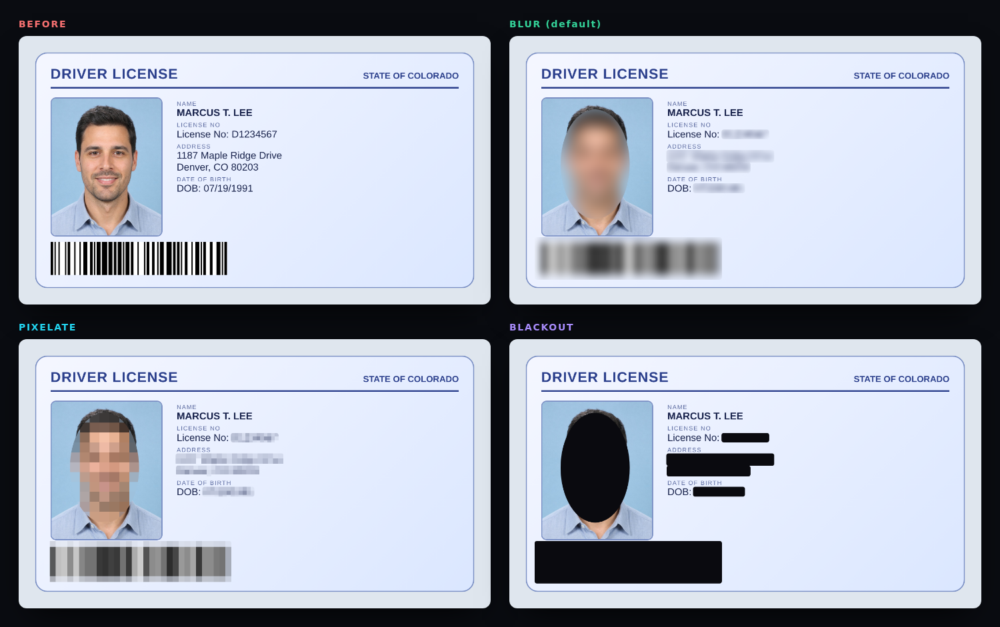
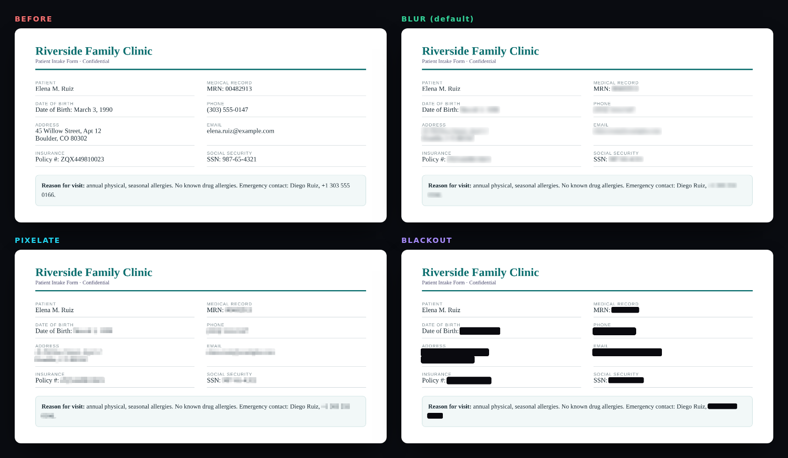
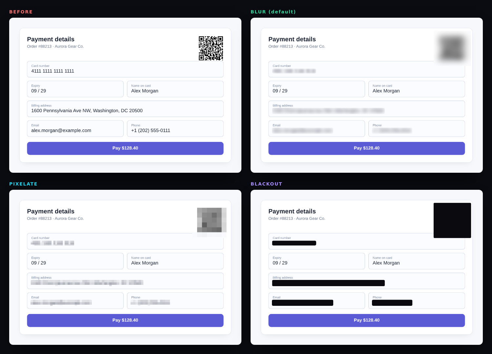
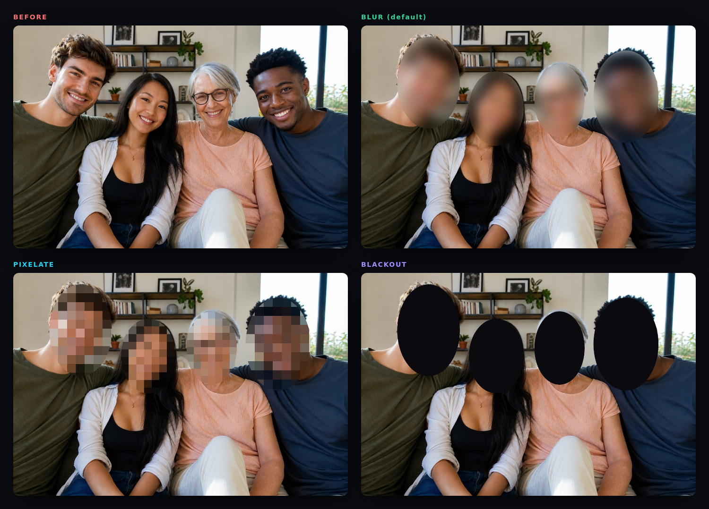
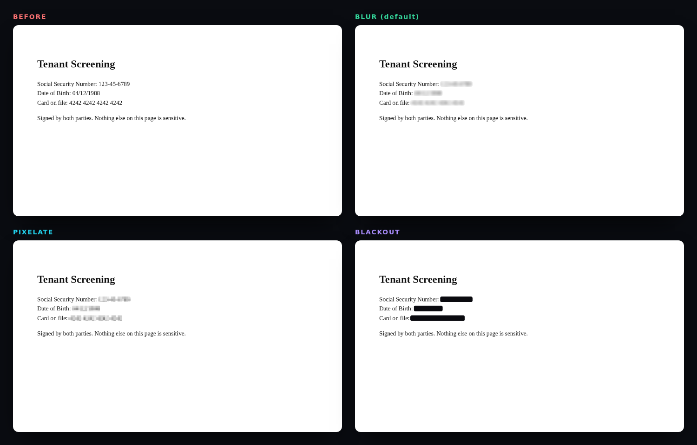

# Before & after gallery

Every image below was produced by the **real app** (production build, headless Chromium) — nothing is mocked up. Each sheet shows the original plus all three styles. All people, numbers and addresses are fictional (portraits are AI-generated; `4242…` / `4111…` are public test card numbers).

Regenerate everything with:

```bash
npm run build && npx vite preview --port 4173 &
npm run examples          # writes docs/examples/*
```

| Style | Looks like | Best for |
| --- | --- | --- |
| **Blur** *(default)* | Soft, aesthetic smudge | Social posts, Slack, Discord, screenshots for AI tools |
| **Pixelate** | Classic mosaic | When it should be obvious something was hidden |
| **Blackout** | Solid bar (ellipse over faces) | Legal, HR, medical, anything where you want zero doubt |

All three destroy the underlying pixels (block-averaging happens *before* any smoothing), so none of them can be reversed.

---

## 1 · Pay stub — image with photo, QR code and barcode

**Found:** SSN, DOB, 2 addresses, email, 2 phones, card, account + routing numbers, face, QR code, Code 128 barcode.



## 2 · Dark-mode Slack chat — screenshot with secrets

**Found:** password, Stripe key, AWS key, street address + city/state/ZIP, phone, email. (Dark themes are inverted before OCR, and OCR-mangled keys like `sk live …` are still caught.)



## 3 · Driver's license — ID card with photo and barcode

**Found:** licence number, address, date of birth, face, barcode. (Names aren't auto-detected — see [Limitations](../README.md#limitations).)



## 4 · Medical intake form — labelled fields, wrapped lines

**Found:** medical record no., DOB, phone, address, email, policy number, SSN, and an emergency-contact phone number that **wraps across two lines**.



## 5 · Checkout page — card, billing details, QR

**Found:** card number, billing address, email, phone, payment QR code.



## 6 · Group photo — faces only

**Found:** all four faces (elliptical masks). Metadata is stripped too.



## 7 · Lease PDF (page 2) — PDF with a real text layer

**Found:** SSN, DOB, card number, address, email. The PDF is flattened on export, so the text underneath is gone — not just covered.



---

Individual files (`before`, `blur`, `pixelate`, `blackout`) for each example live in [`docs/examples/<name>/`](examples/).
